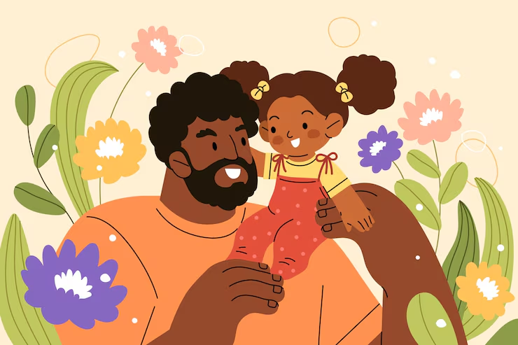

# Is your dad weird?

Asking SMI and MIT Students If They Think Their Dad is Weird

EXPERIMENT OBJECTIVE: To find out if SMI dads are weirder than MIT dads.

## *1. Setting up R Packages*

```{r}
# SETUP CHUNK- LIBRARIES
#| label: setup
#| echo: false
#| warning: false
#| message: false

library(tidyverse)
library(mosaic) # Our all-in-one package
library(skimr) # Looking at data
library(janitor) # Clean the data
library(naniar) # Handle missing data
library(visdat) # Visualise missing data
library(tinytable) # Printing Static Tables for our data
library(DT) # Interactive Tables for our data
library(crosstable) # Multiple variable summaries

library(vcd)
library(visStatistics) # One package to test them all
### Dataset from Chihara and Hesterberg's book (Second Edition)
library(resampledata)
```

## 2. *Read Data*

```{r}
dad_modified <- dad <- readr::read_csv("../data/3-weird_dads.csv")%>%
  # Clean variable names
  janitor::clean_names(case="snake")
dad_modified
```

## 3. *Examine Data*

```{r}
dplyr::glimpse(dad_modified)
```

```{r}
skimr::skim(dad_modified)
```

```{r}
names(dad_modified)
```

```{r}
visdat::vis_dat(dad, sort_type = TRUE, palette = "default")
```

```{r}
dad_modified <- dad %>% tidyr::drop_na()
dad_modified
```

```{r}
visdat::vis_dat(dad_modified, sort_type = TRUE, palette = "default")
```

```{r}
dad_modified %>%
  dplyr::count(gender, college) %>%
  tt()
```

```{r}
dad_modified <- dad %>%
  dplyr::mutate(across(where(is.character), as.factor))
glimpse(dad_modified)
```

```{r}
dad_modified %>%
  stats::setNames(c("Gender", "College", "Is_Your_Dad_Weird","Name"))

dad_modified %>%
  DT::datatable(
    style = "default",
    caption = htmltools::tags$caption(
      style = "caption-side: top; text-align: left; color: black; font-size: 100%;", "Weird Dads Dataset (Clean)"
    ),
    options = list(pageLength = 10, autoWidth = TRUE)
  ) %>%
  DT::formatStyle(
    columns = names(dad_modified),
    fontFamily = "Roboto Condensed",
    fontSize = "12px",
  )
```

## 4. *Data Dictionary*

### *Qualitative Data*

1.  gender(fct): Gender of student (M/F/NB)
2.  college(fct): Which college the student is from (SMI/MIT)
3.  is_dad_weird(fct): If the student thinks their dad is weird (Yes/No)
4.  name(fct): Name of the student

# 5. *Graphs*

## 1. Are SMI dads weirder than MIT dads?

```{r}
vcd::structable(data = dad_modified, is_dad_weird ~ college) %>% 
  as.matrix() %>%  
  addmargins()
```

```{r}
vcd::structable(is_dad_weird ~ college, data = dad_modified) %>%
    vcd::mosaic(gp = shading_max,
                main = "Are SMI dads weirder than MIT dads?")
```

### Inferences

Only a few MIT students find their dads weird, than expected. But, more SMI students find their dads weird, than expected. In both cases, students are more likely to find their dads normal. Also, we can conclude that according to this sample, SMI dads are weirder than MIT dads.

## 2. Irrespective of the college, which gender is more likely to find their dads weird?

```{r}
dad_modified %>% 
  gf_bar(~ is_dad_weird | gender,
         fill = ~gender) %>% 
  gf_labs( title = "Irrespective of the college, which gender is more likely to find their dads weird?",
           x = "Is Your Dad Weird?",
           y = "Count") %>% 
  gf_refine(scale_fill_brewer(palette = "Paired"))
```

### Inferences

In general, it is more likely that women find their dads weird than men. This could be because some girl dads can come off as overprotective or 'embarrassing'. The only non-binary student from MIT also finds their dad weird. Perhaps their father is not as supportive as they'd like.

## 3. Are women more likely to find their dads weird than men?

```{r}
dad_modified2 <- dad_modified %>%
  filter(gender != "NB")

dad_modified2 %>% 
  gf_bar(~ gender | college,
         fill = ~ is_dad_weird,
         position = "fill") %>%
  gf_labs(
    title = "Are women more likely to find their dads weird than men?",
    x = "Gender",
    y = "Proportion",
    fill = "Legend: Is Your Dad Weird?")
```

### Inferences

In the mosaic graph, we could only infer that SMI dads are weirder than MIT dads, but here we can also talk about it with respect to gender. In SMI, boys are more likely to find their dads weird, and in MIT, girls are more likely to find their dads weird.

This reason behind this could be that some dads are not very supportive when it comes to sending their son to a design school and would rather have them do engineering. Because of clashes with their dads, maybe SMI boys find their dads weird. Same goes for MIT girls who took up engineering.

## 4. Are students more likely to think their dads are weird?

```{r}
dad_modified %>% 
  gf_bar(~ is_dad_weird, fill = ~ is_dad_weird) %>% 
  gf_labs( title = "Are students more likely to think their dads are weird?",
           x = "Is Your Dad Weird?",
           y = "Count",
           fill = "Legend: Is Your Dad Weird?") %>% 
  gf_refine(scale_fill_brewer(palette = "Accent", direction =-1))
```

### Inferences

Overall, students are more likely to find their dads normal.

## 6. *Summary of Inferences*

Overall, most students across both colleges find their dads normal. However, based on this sample, SMI students are slightly more likely to find their dads weird than MIT students. When looking at gender, MIT girls appear more likely to perceive their dads as weird, while in SMI, boys show this trend more. These differences may reflect family expectations, academic choices, and communication dynamics rather than universal patterns.

## 7. *Surprising Aspects*

I thought MIT dads would be weirder than SMI dads because I assumed that dads who allow their children to study in a design school would be fun, easy-going and open-minded and would not be considered weird by their children. Results could change if a different sample was taken, perhaps after exam results are released.

## 8. *Pearson's Chi-squared test- Inference test for two proportions*

```{r}
contingency_table <- vcd::structable(data = dad_modified, is_dad_weird ~ college) %>% 
  as.matrix() %>%  
  addmargins()

xq_test_object <- xchisq.test(contingency_table)
```

```{r}
xq_test_object %>%
  broom::tidy() %>%
  select(statistic) %>%
  as.numeric() -> X_squared_observed
X_squared_observed
```

Let us also evaluate the critical value for the Chi-Square distribution, with alpha = 0.05 and df = (nrows-1)\*(ncols-1) = 4:

```{r}
# Determine the Chi-Square critical value
X_squared_critical <- qchisq(
  p = .05,
  df = 4, # (nrows-1) * (ncols-1)
  lower.tail = FALSE
)
X_squared_critical
```

We see that our observed chi squared value = 4.547698, and the critical value = 9.487729, which is larger. The p-value is 0.3369, which is greater than 0.05, indicating that the NULL hypothesis cannot be rejected. Therefore, we do not have enough evidence to conclude that the proportions of students who find their dads weird differ by college.
